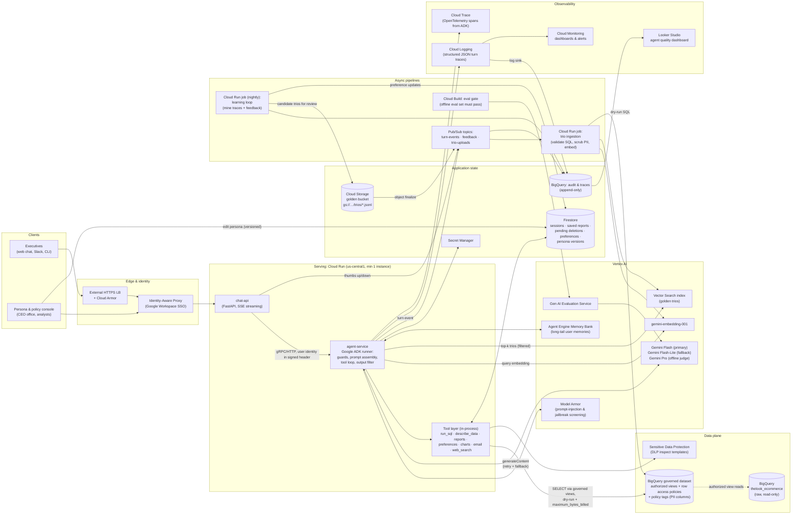
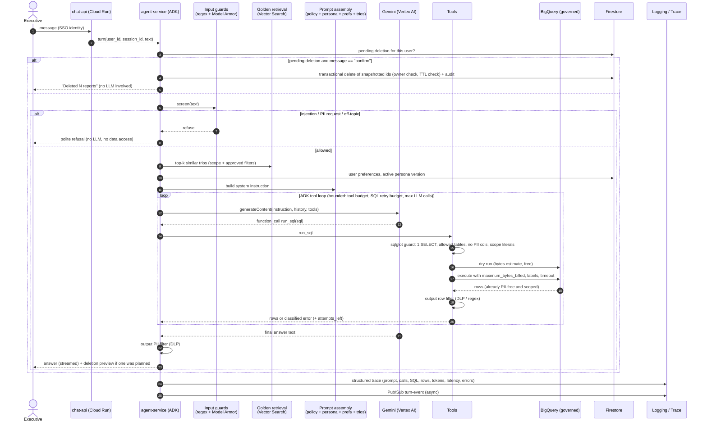
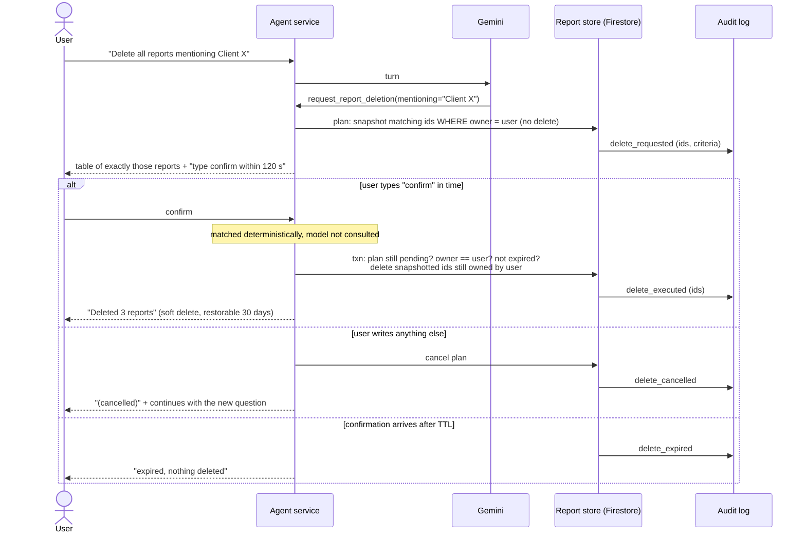

# Architecture (HLD)

This document holds the diagrams. [TECHNICAL.md](TECHNICAL.md) explains each block, the reasoning
behind it and how each requirement is met. The prototype in `src/` implements the **Agent service**
box end to end on a laptop. The [last section](#prototype-vs-production-mapping) maps every prototype
component to its production counterpart.

## 1. Production high-level design (GCP)

**Where data lives**

| Data | Store | Why |
|---|---|---|
| Transaction logs (source of truth) | BigQuery `bigquery-public-data.thelook_ecommerce` (read-only) | Given. Never queried directly by the agent's service account. |
| Governed, PII-free, per-user-filtered view of it | BigQuery dataset `opsfleet_governed`: authorized views + row access policies + policy tags | Enforced by the warehouse itself, so every client is protected, not just the agent. |
| Golden trios (raw) | Cloud Storage bucket `gs://opsfleet-golden/trios/` (JSONL, versioned objects) | Analysts drop files; versioning gives history and rollback. |
| Golden trios (searchable) | Vertex AI Vector Search (embeddings + metadata) | Low-latency semantic top-k with filters (approved, domain, freshness). |
| Sessions, saved reports, pending deletions, preferences, persona versions | Firestore (Native mode) | Per-user documents, transactions for the delete flow, TTL on pending deletions, no ops. |
| Audit log, turn traces, feedback | BigQuery dataset `opsfleet_ops` (append-only, via Pub/Sub + log sink) | Cheap long-term storage, SQL for debugging and dashboards. |
| Secrets (API keys for 3rd-party tools) | Secret Manager | Gemini on Vertex AI uses the service account (no key). |

## 2. Request flow (one chat turn)

## 3. Destructive operation (delete reports): two-phase commit with a human in the loop

## 4. Learning loops

```mermaid
flowchart TB
    subgraph User-level ["User level (per person, immediate)"]
        S1["User states a preference<br/>'tables please', 'shorter'"] --> T1["remember_preference tool"]
        S2["Implicit signals<br/>(re-asks for brevity, asks 'as a table' 3x)"] --> T2["nightly job infers preference<br/>source=inferred, never overrides explicit"]
        T1 --> PF[("Preference profile<br/>Firestore")]
        T2 --> PF
        PF --> PROMPT["Injected into the system instruction<br/>on every turn"]
    end

    subgraph System-level ["System level (whole agent, reviewed)"]
        TR[("Traces + feedback<br/>BigQuery")] --> MINE["Nightly mining job"]
        MINE --> C1["Thumbs-up answers backed by SQL<br/>→ candidate trios"]
        MINE --> C2["Failure clusters<br/>(SQL error types, empty results,<br/>refusals, low ratings)"]
        C1 --> REVIEW["Analyst review queue"]
        REVIEW -->|approve| GOLD[("Golden bucket → Vector Search")]
        C2 --> FIX["Prompt / catalogue / guard fixes<br/>+ new eval cases"]
        FIX --> EVALSET[("Offline eval set")]
        EVALSET --> GATE["CI eval gate before deploy"]
        GOLD --> RET["Retrieved at query time"]
    end
```

## Prototype vs production mapping

| Building block | Prototype (this repo) | Production |
|---|---|---|
| Client | Rich CLI (`opsfleet --user alice`) | Web chat / Slack app behind IAP |
| Identity & scope | `--user` flag + `config/users.toml` | Workspace SSO via IAP; entitlements table keyed by principal |
| Agent orchestration | Google ADK `LlmAgent` + `Runner`, in-process | Same code on Cloud Run (or Vertex AI Agent Engine) |
| LLM | Gemini via AI Studio key, `ResilientGemini` (retry → fallback) | Gemini on Vertex AI (service account, provisioned throughput for the primary) |
| Input guard | Regex classifier (`security/input_guard.py`) | Regex fast path + Model Armor |
| SQL governance | sqlglot guard + governed CTEs per query | Same guard + BigQuery authorized views, row access policies, policy tags |
| Output PII filter | Regex row/text filter (`security/pii.py`) | Sensitive Data Protection (DLP) inspect + regex fast path |
| Golden trios | `data/golden_trios.jsonl` + BM25 (`knowledge/golden.py`), hot reload | GCS bucket → ingestion job → Vector Search, hybrid retrieval |
| Reports, deletions, audit, prefs | SQLite (`var/opsfleet.db`) | Firestore + BigQuery audit table |
| Persona | `config/persona.md`, re-read on change | Firestore-versioned persona edited from an admin console |
| Traces & metrics | JSONL (`var/traces.jsonl`), `/trace`, `/metrics` | Cloud Logging + Cloud Trace + BigQuery sink + Looker Studio / Monitoring alerts |
| Feedback → learning | `/feedback` → `var/feedback.jsonl`, `var/golden_candidates.jsonl` | Pub/Sub → BigQuery → nightly mining job → review queue |
| Evaluation | pytest (offline, mocked) + live smoke script | Offline eval set in CI with Gen AI Evaluation Service + online metrics |
